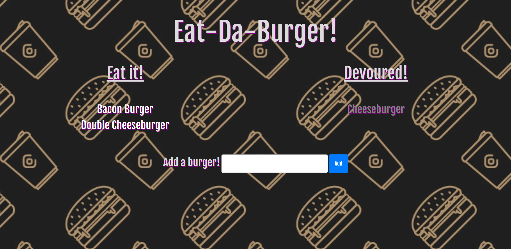

# Eat-Da-Burger

In this repository I created a full-stack web application from scratch that allows the user to "create" and "eat" burgers. Using MySQL, it allows the user to click on a burger, manipulating its corresponding table data on the back-end, and thus changing its location on the front-end. Similarly, when the user creates a burger, it adds this burger data to the table in the database, and is displayed on the screen for the user to manipulate.

This application was built using the Model-View-Controller model (MVC), and was deployed to Heroku using JawsDB.

[Here is a link to the application.](https://shrouded-springs-57416.herokuapp.com/)

